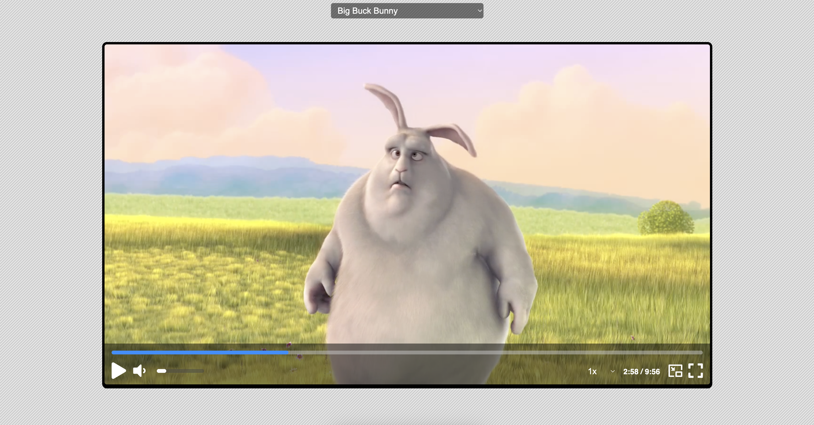

# Custom Video Player

Exercise Project of `ZTM` Cours on Udemy ([JavaScript Web Projects: 20 Projects to Build Your Portfolio](https://www.udemy.com/course/javascript-web-projects-to-build-your-portfolio-resume)).

## Description

Extended with additional functions:

- Picture in Picture
- Videos Library as selector

## Useful references

- [pixabay - free stock image/videos](https://pixabay.com)
- [mixkit - free stock video](https://mixkit.co/free-stock-video/)
- [GitHub - media list](https://gist.github.com/jsturgis/3b19447b304616f18657)
- [W3Schools - HTML Audio/Video DOM Reference](https://www.w3schools.com/tags/ref_av_dom.asp)
- [W3Schools - How TO - Fullscreen](https://www.w3schools.com/howto/howto_js_fullscreen.asp)
- [Mozilla - Picture-in-Picture API](https://developer.mozilla.org/en-US/docs/Web/API/Picture-in-Picture_API)
- [Chrome for Developers - Picture-in-Picture](https://developer.chrome.com/docs/web-platform/document-picture-in-picture)
- [svgrepo](https://www.svgrepo.com/)